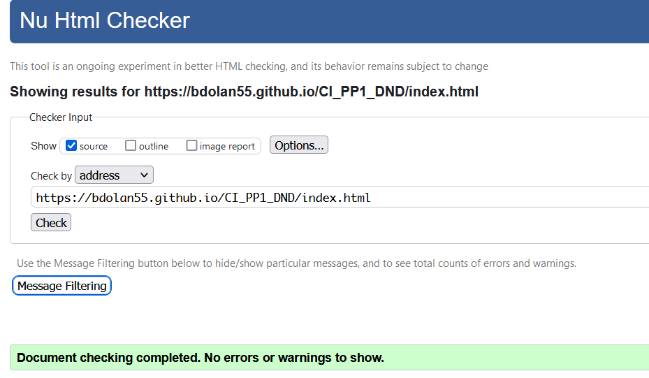

# DND Group
(Developer: Brian Dolan)

[Live webpage](https://bdolan55.github.io/CI_PP1_DND/)

## Table of Content

1. [Project Goals](#project-goals)
    1. [User Goals](#user-goals)
    2. [Site Owner Goals](#site-owner-goals)
2. [User Experience](#user-experience)
    1. [Target Audience](#target-audience)
    2. [User Requrements and Expectations](#user-requrements-and-expectations)
    3. [User Stories](#user-stories)
3. [Design](#design)
    1. [Design Choices](#design-choices)
    2. [Colour](#colours)
    3. [Fonts](#fonts)
    4. [Structure](#structure)
    5. [Wireframes](#wireframes)
4. [Technologies Used](#technologies-used)
    1. [Languages](#languages)
    2. [Frameworks & Tools](#frameworks-&-tools)
5. [Features](#features)
6. [Testing](#validation)
    1. [HTML Validation](#HTML-validation)
    2. [CSS Validation](#CSS-validation)
    3. [Accessibility](#accessibility)
    4. [Performance](#performance)
    5. [Device testing](#performing-tests-on-various-devices)
    6. [Browser compatibility](#browser-compatability)
8. [Bugs](#Bugs)
9. [Deployment](#deployment)
10. [Code used and adapted](#Code-used-and-adapted)

## Project Goals 

### User Goals
- Find out who DND Group are as and what they can provide in the Construction Industry.
- See profiles and contact details for all managerial staff.
- To view portfolio of works completed by DND Group.
- Find DND Group Social Sites for any new updates on projects.
- See location and Contact details for DND Group Office.
- Send message direct from website to DND Group.

### Site Owner Goals
- Promote the business and show Online presence for new or existing customers.
- A place to showcase completed projects by DND Group.
- Information on Company Organisational Structure and Employee Profiles and contact details.
- Company office location and Map.
- Provide contact details to get in touch with DND Group directly through Contact Us Page.

## User Experience

### Target Audience
- Existing and new Customers researching companies to complete Construction works.
- Engineers and Clients to see past project examples to review suitability for future projects.
- New clients looking for Construction Fitout works
- Existing Clients looking for contact details of Managerial staff within DND Group,

### User Requrements and Expectations

- A clean and easy to use website with simple navigation.
- Information from DND Group is easy to find and access
- Easy for existing and new clients to get in contact with DND Group.
- Examples of previous projects completed by DND Group.

### User Stories

#### First-time User 
1. As a first time user, I want to find out information about DND Group.
2. As a first time user, I want to be able find out information on Company Personnel.
3. As a first time user, I want to see past project completed , Project size and Images of works.
4. As a first time user, I want to be able to easily navigate throughout the site and find what information i need easily. 

#### Returning User
5. As a returning user, I want to see where DND Office is located
6. As a returnign user, I want to see what types of work DND can provide me a client
7. As a returning user, I want to see links to the Organisations social sites
8. As a returning user, I want to know how to get in touch with DND Group and Contact details.
 

#### Site Owner 
9.  As the site owner, Provide details of what services DND Group provides as to the Office fitout Industry.
10. As the site owner, Provide information on Company Organisational Structure and Employee Profiles
11. As the site owner, Provide company Case Studies - Information on Projects completed and Image.
12. As the site owner, Provide contact details and How to get in touch for further information.
13. As the site owner, Provide company office location and Map.

## Design

### Design Choices
The DND Group website was designed to be clean, informative and easy to work with which represents the work ethic and customer service DND provide. Modern Images have been used on the site to represent the image of high end and future focused which DND Group provide.  

### Colour
The colors scheme chosen for DND Group site aims to be modern and clean. The grey palette that has been chosen represents that cool and sleek view. I used the Coolors palette website to find the colors used with the website.
 

### Fonts
The Font chosen for the DND Group Website is from the Google Fonts Poppin Family. The font chosen is the Poppins ExtraLight 200. This was chosen to promote the modern, clean functional look that the DND Group site provides to the user.
 

### Structure
The website has been presented in a familiar and user friendly way. The navigation through the website would be familiar to any user arriving to the site. Navigation bar is clean and presented along the top of the page with the NavBar being set to sticky it moves with you as you scroll down the page for easy site navigation. From left to right on Navbar you have DND Group Text to show Owner of site and on the right side shows the headings and links to the other pages within the site. :

- The homepage has a Main Hero Image with Text on top stating DND Group motto. 
- The Our Company page has a paragraph promoting on DND Group ethos and images and contact details to managerial staff within DND Group.
- The Projects page provides images and information regarding jobs DND Group have completed.
- The contact form provides all details to get in touch with DND Group, Contact form and Map to DND Group office. 

### Wireframes

Home

Our Company

Our Projects

Contact Us

## Technologies Used

### Languages
- HTML - Used for the Basic Layout of the DND Group Website.
- CSS - Used for the styling of the DND Group Website.
- JavaScript - Used for Burger Menu Toggle Button in the smaller screen sizes.

### Frameworks & Tools
- GitHub - Storing the pushed code and Version Control.
- Gitpod - Online IDE.
- Bootstrap Version 5.2 - Carousel Images on Home Page.
- Tinypng - Used to Compress the Images for the Website.
- Balsamiq - Wireframe Software used at start of Project for site layout.
- Google Fonts - Used for the fonts within the website. Link within Head of the website
- Font Awesome - Used for the Socials Tags in footer
- Favicon - Used for the Browser tab Logo. Link within head of Website.

## Features
The page consists of Four pages and eight site features.

### Logo and Navigation Bar
- The navbar is has transparent / blurry look to give off the glass effect.
- The navbar is stick throughout the page scrolling to assist in site navigation.
- The navbar is fully responsive and uses a toggle burger effect menu for smaller screen sizes and includes links to all 4 pages on the DND Group site.
- The navbar also has Hover and underline effect when pointer hovers on page link.
- DND Logo on navbar in Poppins Font to continue continuity through website with clean, simple and effective look.

### Carousel
- The 3no. Carousel Images are to promote clean / stylish look and emphasise on Lighting effects.
- Text positioned on top of Carousel Images promoting DND motto.
- The Carousel contains 3no Images that can be scrolled with the use of pointer arrows buttons on both the left and right hand side of image. 

### Our Company Ethos
- The Our Company section shows a block of text for viewers to gain better understanding of what DND Group can provide.
- Image on right side of text to promote the type of work and standard DND Group provide

### Our Company Employee Profiles
- Clean Professional profile Images of Managerial Staff within DND Group.
- Hover Effect on Staff when pointer lands on profile image to show Name, Position and Contact details for Managerial Staff within DND Group.

### Footer
- The footer is a feature that continues through all 4no. pages on the website.
- The footer contains the company address, Phone no, Email and Links to DND Group Socials.

### our Projects
- Example Images of projects completed by DND Group.
- Hover Effect on project images when pointer lands on image to show Project Type, Size and Timescale of that paticular project.

### Contact Form
- The contact Us section Shows the company details to the left of a clean minimalistic contact form and message box on the right side of the screen.
- The Contact form has a "Send Message" button with Hover effect to an orange colour for effect.
- The Form is linked to code institute form dump to show contact form details entered and sent.

### Map
- The embedded Google Map is located below the Contact form section and takes up width of screen view.

## Validation
 

### HTML Validation

W3C Markup Validation has been used to validate the HTML code within from the website. All the pages have passed with no errors or no warnings.

Home

Our Company

Our Projects

Contact Us

 

### CSS Validation
W3C Jigsaw CSS Validator has been used validate the CSS code within the website.Errors occured when validating the page with the site link as the W3C Jigsaw CSS Validators showed linked to Bootstrap version 5.2. The CSS code was pasted direct into the W3C Jigsaw CSS Validator and showed no errors found.

whole page

style.css

 

### Accessibility
The WAVE WebAIM web accessibility evaluation tool was used to ensure the website met high accessibility standards. All pages pass with 0 errors.

Home

Our Company

Our Projects

Contact Us

 

### Performance 
The DND Group website was tested for performance using Google Lighthouse within Google Chrome Developer Tools.

Home

Our Company

Our Projects

Contact Us

### Performing tests on various devices 
The website was tested on the following devices:
- Redmi Note 11 Pro 5G
- Lenovo Ideapad Flex 5

The website was also tested using Google Chrome Developer Tools Device Toggeling option for all available device options.

### Browser compatability
The website was tested on the following browsers:
- Google Chrome
- Mozilla Firefox
- Microsoft Egde

## Bugs

## Deployment
The website was deployed using GitHub Pages by following these steps:
1. In the GitHub repository navigate to the Settings tab
2. 

You can for fork the repository by following these steps:
1. Go to the GitHub repository
2. Click on Fork button in upper right hand corner

You can clone the repository by following these steps:
1. Go to the GitHub repository 
2. 

## Credits
Images not referenced below are owned by the developer.

### Media
In order of apearance:
- [carousel-1](): Photo by <a href="">Photographer</a> on <a href="">Pexels</a>
- [carousel-1](): Photo by <a href="">Photographer</a> on <a href="">Pexels</a>
- [carousel-1](): Photo by <a href="">Photographer</a> on <a href="">Pexels</a>
- [carousel-1](): Photo by <a href="">Photographer</a> on <a href="">Pexels</a>
- [carousel-1](): Photo by <a href="">Photographer</a> on <a href="">Pexels</a>
- [carousel-1](): Photo by <a href="">Photographer</a> on <a href="">Pexels</a>
- [carousel-1](): Photo by <a href="">Photographer</a> on <a href="">Pexels</a>
- [carousel-1](): Photo by <a href="">Photographer</a> on <a href="">Pexels</a>
- [carousel-1](): Photo by <a href="">Photographer</a> on <a href="">Pexels</a>
- [carousel-1](): Photo by <a href="">Photographer</a> on <a href="">Pexels</a>
- [carousel-1](): Photo by <a href="">Photographer</a> on <a href="">Pexels</a>
- [carousel-1](): Photo by <a href="">Photographer</a> on <a href="">Pexels</a>
- [carousel-1](): Photo by <a href="">Photographer</a> on <a href="">Pexels</a>
- [carousel-1](): Photo by <a href="">Photographer</a> on <a href="">Pexels</a>
- [carousel-1](): Photo by <a href="">Photographer</a> on <a href="">Pexels</a>
- [carousel-1](): Photo by <a href="">Photographer</a> on <a href="">Pexels</a>

  
### Code used and adapted

In order of apearance:
- 
- 
- 
- 